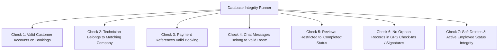

# SQA Database Integrity & Verification Suite

## Overview
This verification suite (`server/scripts/verify_database_integrity.js`) performs automated relational and logical checks across database `home` to guarantee zero orphan records, cross-tenant isolation, review eligibility constraints, and technician company matching.

---

## Checked Database Integrity Constraints



---

## Execution Command
```bash
node server/scripts/verify_database_integrity.js
```
