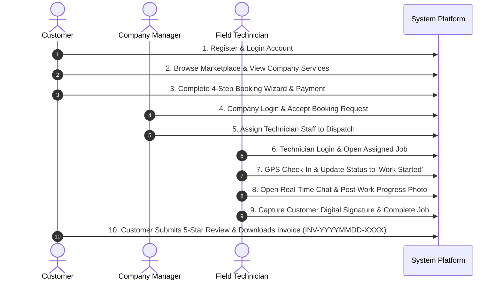

# SQA End-to-End (E2E) Playwright Test Automation Guide

## Overview
This Playwright test suite (`client/e2e/full_workflow.spec.js`) simulates the complete lifecycle of an enterprise service request across all 4 system roles (**Customer**, **Company Manager**, **Field Technician**, and **Admin**).

---

## E2E Lifecycle Flow Diagram



---

## Running the Playwright Test Suite

### 1. Prerequisites
Ensure the application backend and frontend dev servers are running:
```bash
# Terminal 1: Backend Server (Port 5000)
node server/index.js

# Terminal 2: Frontend Client (Port 5173)
cd client
npm run dev
```

### 2. Execute Playwright E2E Spec
```bash
npx playwright test client/e2e/full_workflow.spec.js --headed
```
